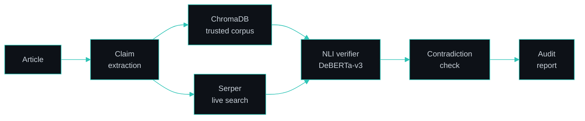

 

I build computer vision and GenAI projects in Python, and full-stack web apps with Django and React. 
My work so far covers **agriculture**, **finance**, and **LLM-based fact-checking**.

 

<table>
<tr>
<td width="33%" valign="top">

### 💼 Now
Software Development Intern 
**Pentagon Space**, Bengaluru 
Jan 2026 – present

</td>
<td width="33%" valign="top">

### 🏅 Recognition
Selected for **NAIN** (New Age Innovation Network), a government-backed incubation program 
For a stored-grain pest detection system

</td>
<td width="33%" valign="top">

### 🎯 Open to
AI Engineer and Full Stack / SDE fresher roles 
Bengaluru · Hyderabad · Remote (India)

</td>
</tr>
</table>

 

## About

I'm an AI & ML graduate who likes taking a project from idea to a working system. I've built computer vision tools for agriculture, including a 33-class plant disease classifier with a deployed web app and a stored-grain pest detection system selected for the NAIN incubation program. I've also built a LangGraph-based agent that fact-checks articles claim by claim.

At Pentagon Space, I work on full-stack development with Django, React, and REST APIs, and built a loan management system there. I'm now going deeper into RAG and agent workflows with LangChain and LangGraph.

 

## Featured Projects

### 🛡️ [AI Misinformation Audit Agent](https://github.com/Deepika6689/misinfoagent-project)

Feb – Mar 2026

A fact-checking system that reads an article claim by claim, gathers evidence, and produces a structured credibility report.

- **Two evidence sources:** a ChromaDB store built from a trusted corpus, plus live web search (Serper API) for recent claims the corpus can't cover.
- **Why NLI:** a dedicated DeBERTa-v3 model labels each claim Supported, Refuted, or Not Enough Information, instead of asking an LLM "is this true?". The verdict is narrower and easier to audit.
- **Contradiction detection:** claims are also compared against each other, so articles that contradict themselves get flagged.
- **Orchestration and serving:** LangGraph runs the steps as an explicit graph, served through a FastAPI backend with a web frontend.

 

### 🌾 Insect & Pest Detection in Stored Grains · NAIN Program

Selected for the NAIN incubation program (government-backed)

Insects in stored grain are a major cause of post-harvest loss. This project uses computer vision to detect them and support grain storage monitoring.

- **Detection:** real-time detection logic built with OpenCV.
- **Application:** a Tkinter desktop GUI, with SQLite storing monitoring data.

 

### 💳 [Loan Management System](https://github.com/Deepika6689/loan-project)

Feb – Apr 2026 · Built during internship

A full-stack platform with separate user and admin portals.

- **Features:** loan applications, an approval workflow, EMI tracking, an analytics dashboard, and secure authentication.
- **Role:** built end to end as part of my internship project work.

 

### 🌿 [Plant Disease Detection: Smart AgroVision](https://github.com/Deepika6689/Smart-AgroVision)

Original build Mar – Jul 2025 (Team Lead) · [Live demo](https://jovial-phoenix-7c8303.netlify.app/) · [Original repo](https://github.com/Deepika6689/plant-disease-detection)

A CNN-based classifier that identifies 33 plant disease classes from leaf images, later rebuilt as a React + TypeScript web app deployed on Netlify.

- **Original build:** CNN architecture plus an image preprocessing and prediction pipeline (TensorFlow, Keras, OpenCV, NumPy).
- **Web app:** upload a leaf image and get the predicted disease with severity, causes, symptoms, and suggested treatments.

 

## Experience

**Software Development Intern** · Pentagon Space, Bengaluru · *Jan 2026 – Present*

| | |
| :-- | :-- |
| **Training** | Full-stack development with Django, React, and REST APIs |
| **Project work** | Built the [Loan Management System](https://github.com/Deepika6689/loan-project) (Django + MySQL) end to end |
| **Team practice** | Worked across the development lifecycle, including backend–frontend integration, SQL databases, and Git |

 

## Tech Stack

<table>
<tr>
<td width="25%"><b>Languages</b></td>
<td></td>
</tr>
<tr>
<td><b>ML & Computer Vision</b></td>
<td>&nbsp; Keras · NumPy</td>
</tr>
<tr>
<td><b>GenAI</b></td>
<td>LangGraph · LangChain · RAG · ChromaDB · NLI verification</td>
</tr>
<tr>
<td><b>Backend & Data</b></td>
<td>&nbsp; REST APIs</td>
</tr>
<tr>
<td><b>Frontend</b></td>
<td>&nbsp; Tkinter (desktop)</td>
</tr>
<tr>
<td><b>Tools</b></td>
<td></td>
</tr>
</table>

 

## Education & Certifications

**B.E. in Artificial Intelligence & Machine Learning** 
PDA College of Engineering, Kalaburagi, Karnataka · 2022 – 2026 · CGPA 8.0

| Certification | Issuer | Date |
| :-- | :-- | :-- |
| Python with Data Science | Ethnotech Academic Solutions Pvt. Ltd. | Jun 2025 |
| Complete Python with DSA & LeetCode | Udemy | Sep 2025 |
| Advanced Programming in C | Cisco Networking Academy | Feb 2024 |

 

## Currently

| 📚 Learning | 🔨 Building | ⏭️ Next |
| :-- | :-- | :-- |
| LangChain and LangGraph (course work in progress) | A LangChain document-ingestion pipeline | A RAG system with hybrid search, then an agent orchestration project |

 

