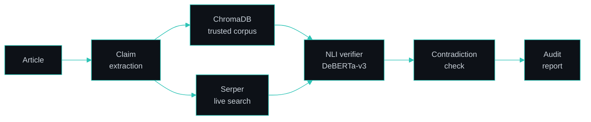

 

I build computer vision and GenAI projects in Python, and full-stack web apps with Django and React. My work so far covers agriculture, finance, and LLM-based fact-checking.

<table>
<tr>
<td width="33%" valign="top">

**Now** 
Software Development Intern at Pentagon Space, Bengaluru (Jan 2026 – present)

</td>
<td width="33%" valign="top">

**Recognition** 
Selected for the NAIN (New Age Innovation Network) government-backed incubation program

</td>
<td width="33%" valign="top">

**Open to** 
AI Engineer and Full Stack / SDE fresher roles. Bengaluru, Hyderabad, or remote (India)

</td>
</tr>
</table>

---

## About

I'm an AI & ML graduate who likes taking a project from idea to a working system. I've built computer vision tools for agriculture, including a 33-class plant disease classifier with a deployed web app and a stored-grain pest detection system selected for the NAIN incubation program. I've also built a LangGraph-based agent that fact-checks articles claim by claim.

At Pentagon Space, I'm working on full-stack development with Django, React, and REST APIs, and built a loan management system there. I'm now going deeper into RAG and agent workflows with LangChain and LangGraph.

---

## Featured Projects

### AI Misinformation Audit Agent

Feb – Mar 2026 · [**Repository →**](https://github.com/Deepika6689/misinfoagent-project)

A fact-checking system that reads an article claim by claim, gathers evidence, and produces a structured credibility report.

- **Two evidence sources:** a ChromaDB store built from a trusted corpus, plus live web search (Serper API) for recent claims the corpus can't cover.
- **Why NLI:** a dedicated DeBERTa-v3 classifier labels each claim Supported / Refuted / Not Enough Information, instead of asking an LLM "is this true?". The verdict is narrower and easier to audit.
- **Contradiction detection:** claims are also compared against each other, so an article that contradicts itself gets flagged.
- **Orchestration and serving:** LangGraph runs the steps as an explicit graph, served through a FastAPI backend with a web frontend.

 

### Insect & Pest Detection in Stored Grains

Selected for the **NAIN incubation program** (government-backed)

Insects in stored grain are a major cause of post-harvest loss. This project uses computer vision to detect them and support grain storage monitoring.

- **Detection:** real-time detection logic built with OpenCV.
- **Application:** a Tkinter desktop GUI, with SQLite storing monitoring data.

 

### Loan Management System

Feb – Apr 2026 · Built during internship · [**Repository →**](https://github.com/Deepika6689/loan-project)

A full-stack platform with separate user and admin portals.

- **Features:** loan applications, an approval workflow, EMI tracking, an analytics dashboard, and secure authentication.
- **My role:** built end to end as part of my internship project work.

 

### Plant Disease Detection (Smart AgroVision)

Original build Mar – Jul 2025 · Team Lead · [**Smart AgroVision repo →**](https://github.com/Deepika6689/Smart-AgroVision) · [**Live demo →**](https://jovial-phoenix-7c8303.netlify.app/) · [Original repo](https://github.com/Deepika6689/plant-disease-detection)

A CNN-based classifier that identifies 33 plant disease classes from leaf images. It was later rebuilt as a React + TypeScript web app and deployed on Netlify.

- **Original build:** CNN architecture plus an image preprocessing and prediction pipeline (TensorFlow, Keras, OpenCV, NumPy), led as team lead.
- **Smart AgroVision:** upload a leaf image and get the predicted disease with severity, causes, symptoms, and suggested treatments.

---

## Experience

**Software Development Intern** · Pentagon Space, Bengaluru · *Jan 2026 – Present*

- **Training:** full-stack development with Django, React, and REST APIs.
- **Project work:** built the [Loan Management System](https://github.com/Deepika6689/loan-project) (Django + MySQL) end to end.
- **Team practice:** worked on projects across the development lifecycle, including backend–frontend integration, using SQL databases and Git.

---

## Tech Stack

**Languages** 

**ML & Computer Vision** 

**Backend & Data** 

**Frontend** 

**Tools & Deployment** 

**GenAI** 

---

## Education & Certifications

**B.E. in Artificial Intelligence & Machine Learning**
PDA College of Engineering, Kalaburagi, Karnataka · 2022 – 2026 · CGPA: 8.0

- Python with Data Science: Ethnotech Academic Solutions Pvt. Ltd. (Jun 2025)
- Complete Python with DSA & LeetCode: Udemy (Sep 2025)
- Advanced Programming in C: Cisco Networking Academy (Feb 2024)

---

## Currently

| Learning | Building | Next |
| :-- | :-- | :-- |
| LangChain and LangGraph (course work in progress) | A LangChain document-ingestion pipeline | A RAG system with hybrid search, then an agent orchestration project |

---

